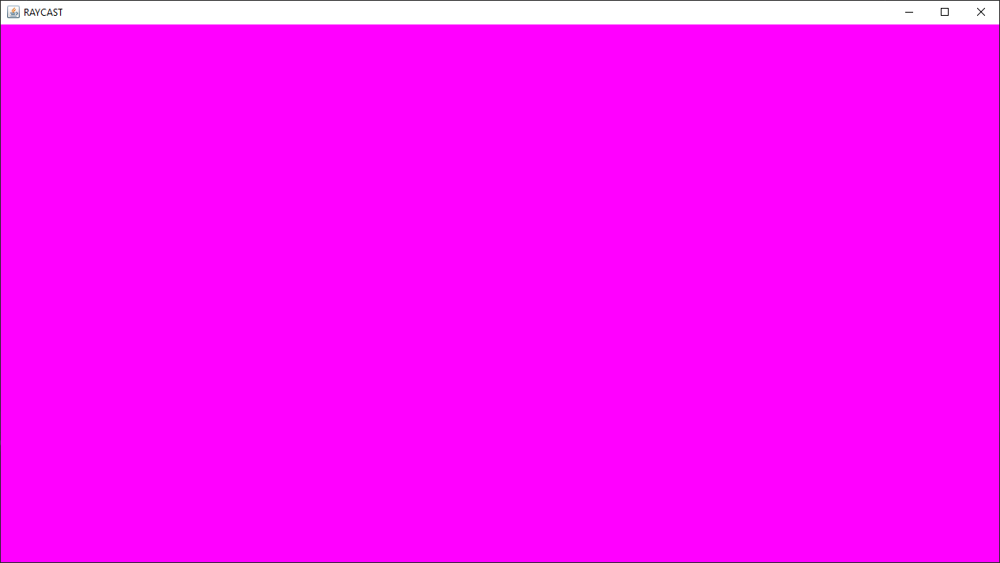

# `RayTracingDemo`

A Ray Casting engine coded from scratch in Java.

## `Versions`
### Ver 0.1
Created the window and added running game loop.

### Ver 0.2
Added keyboard controls and update to movement accordingly.

*White dot can be controlled using WASD*

### Ver 0.3
Added first level and collision detection.

### Ver 0.4
Added direction heading and direction controlled movement.
